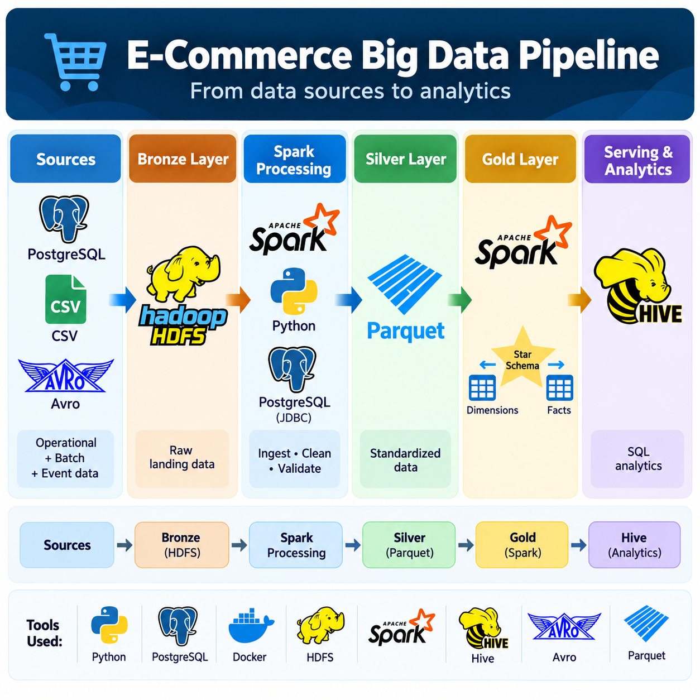
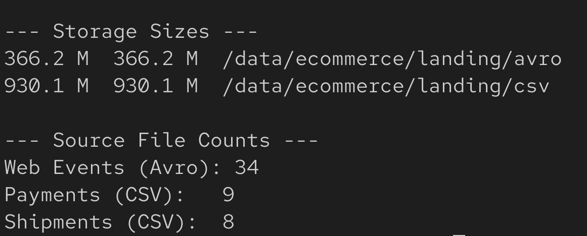
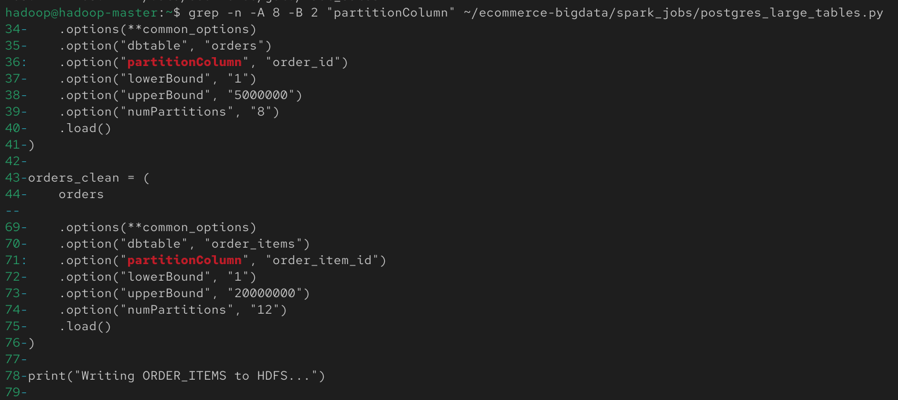
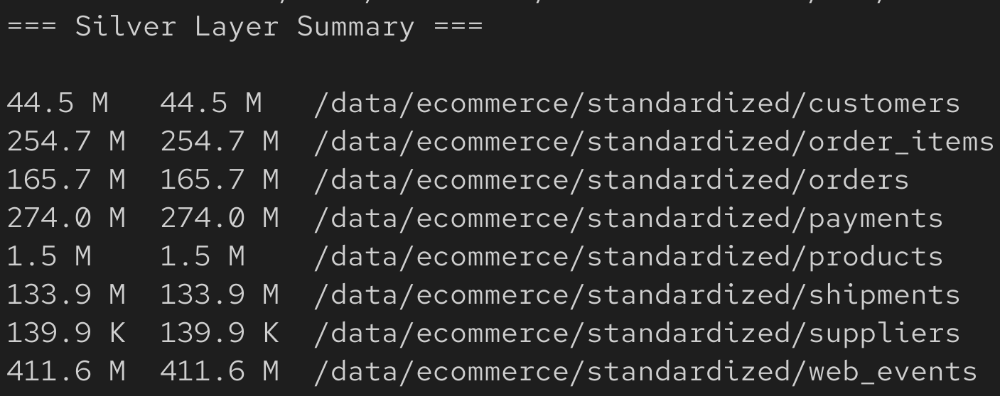
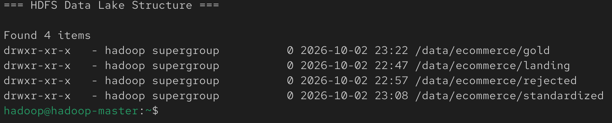
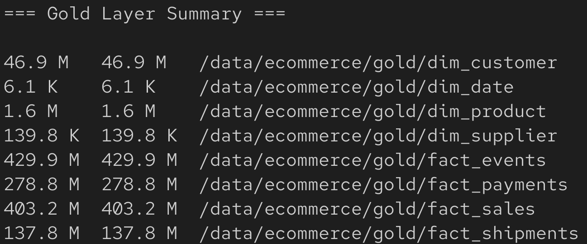
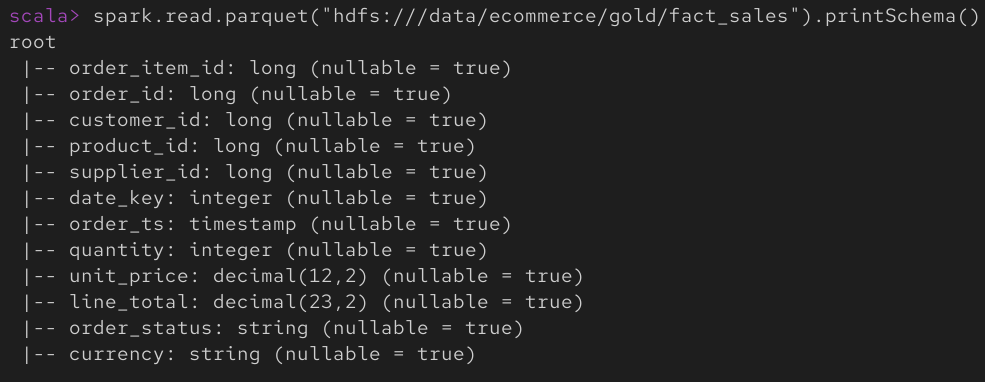
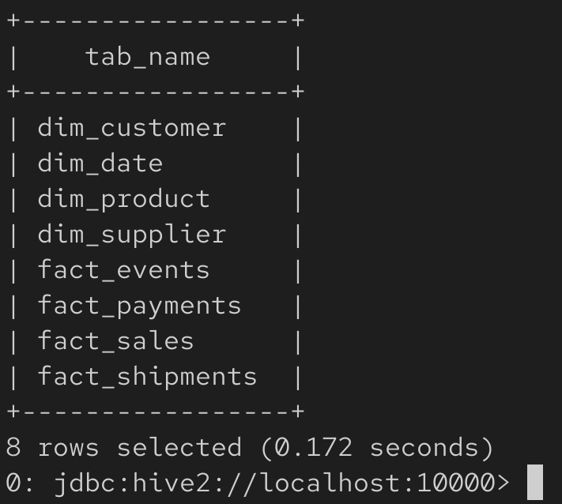
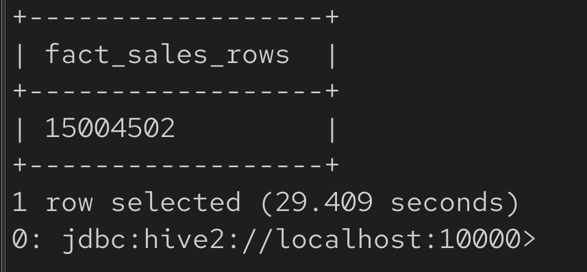
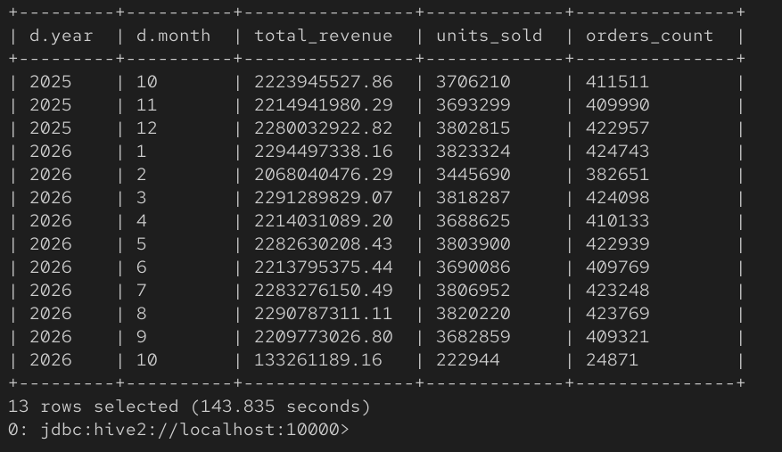

# E-Commerce Big Data Pipeline



## Overview

This repository documents an end-to-end **Big Data Engineering pipeline** built around a synthetic e-commerce platform. The project was designed to demonstrate the complete data engineering lifecycle rather than a single isolated Spark or Hive exercise.

The platform starts by generating realistic e-commerce data across multiple source systems and file formats, moves the raw data into a distributed HDFS data lake, cleans and standardizes it with Apache Spark, builds a business-ready dimensional model in the Gold Layer, and finally exposes the results through Apache Hive for SQL analytics.

The final workflow is:

```text
Sources
  ↓
Bronze Layer (HDFS Landing)
  ↓
Apache Spark Ingestion, Validation & Cleaning
  ↓
Silver Layer (Standardized Parquet)
  ↓
Apache Spark Transformations & Dimensional Modeling
  ↓
Gold Layer (Facts + Dimensions)
  ↓
Apache Hive External Tables
  ↓
SQL Analytics
```

---

## Project Goals

The project was built to demonstrate practical experience with:

- Multi-source ingestion
- Distributed storage using Hadoop HDFS
- Apache Spark / PySpark processing
- PostgreSQL ingestion through JDBC
- Parallel JDBC reads for large relational tables
- CSV and Avro ingestion
- Data validation and rejected-record handling
- Parquet-based analytical storage
- Bronze / Silver / Gold data-lake architecture
- Fact and dimension modeling
- Star-schema design
- Hive External Tables
- HiveServer2 and Beeline
- SQL analytics over tens of millions of records
- Linux, Docker, networking, and large-scale synthetic data generation

---

# 1. Technology Stack

| Technology | Role in the Project |
|---|---|
| **Python** | Synthetic data generation and PySpark jobs |
| **PostgreSQL** | Operational transactional source database |
| **Docker / Docker Compose** | Containerized PostgreSQL source environment |
| **Apache Hadoop HDFS** | Distributed data-lake storage |
| **Apache Spark / PySpark 4.1.1** | Ingestion, validation, cleaning, transformations, joins, and modeling |
| **JDBC** | Direct PostgreSQL-to-Spark ingestion |
| **CSV** | Batch source format for payments and shipments |
| **Avro** | Event source format for web events |
| **Parquet** | Columnar storage for Silver and Gold datasets |
| **Apache Hive 4.2.1** | SQL serving layer and metadata management |
| **HiveServer2 / Beeline** | JDBC-based Hive query interface |
| **Apache Tez** | Hive execution environment |
| **SQL** | Analytical querying |
| **Linux** | Big-data runtime environment |
| **VMware** | Hadoop/Spark/Hive virtual machine environment |

---

# 2. High-Level Architecture

The project uses three major source types:

### Operational database source

PostgreSQL stores:

```text
customers
suppliers
products
orders
order_items
```

### Batch file sources

CSV files store:

```text
payments
shipments
```

### Event source

Avro files store:

```text
web_events
```

The architectural flow is:

```text
PostgreSQL ──JDBC──────────┐
                           │
CSV files ────────┐        │
                  ▼        ▼
               HDFS / Spark
                  ▲
Avro files ───────┘

              ↓

      Bronze → Silver → Gold

              ↓

        Hive External Tables

              ↓

          SQL Analytics
```

---

# 3. Synthetic E-Commerce Data Generator

A custom Python generator was built to create a realistic synthetic e-commerce environment.

The generator produces related records instead of independent random files. This means relationships between orders, customers, products, suppliers, payments, shipments, and events are maintained.

## Generated scale

| Dataset | Volume |
|---|---:|
| Customers | 1,000,000 |
| Suppliers | 5,000 |
| Products | 50,000 |
| Orders | 5,000,000 |
| Order Items | 15,004,502 |
| Payments | ~4.4 million |
| Shipments | ~3.6 million |
| Web Events | ~17 million |

The project therefore processes **more than 40 million logical records**.

## Generator design

The generator uses:

- Deterministic seed configuration
- Batch-based inserts
- File rolling for large outputs
- Referential consistency between datasets
- Controlled data-quality noise

Representative configuration:

```yaml
runtime:
  seed: 42
  batch_size: 20000
  file_rows: 500000
  reset_database: true

scale:
  customers: 1000000
  suppliers: 5000
  products: 50000
  orders: 5000000

generation:
  min_items_per_order: 1
  max_items_per_order: 5

noise:
  enabled: true
  whitespace_rate: 0.015
  casing_rate: 0.020
  optional_null_rate: 0.010
  duplicate_event_rate: 0.005
  late_event_rate: 0.010
```

## Controlled data-quality issues

The generator intentionally introduces realistic issues such as:

- Leading/trailing whitespace
- Casing inconsistencies
- Optional null values
- Duplicate web events
- Late-arriving events

This ensures the Spark pipeline performs real validation and cleaning rather than processing perfectly clean synthetic data.

---

# 4. Source Data Layout

The generated non-database source output consisted of:

- **34 Avro files** for web events
- **9 CSV files** for payments
- **8 CSV files** for shipments

The files were then loaded into HDFS.

---

# 5. Bronze Layer — Raw HDFS Landing

The Bronze Layer stores raw input data with minimal modification.

HDFS paths:

```text
/data/ecommerce/landing/csv/payments
/data/ecommerce/landing/csv/shipments
/data/ecommerce/landing/avro/web_events
```

Example ingestion commands:

```bash
hdfs dfs -mkdir -p /data/ecommerce/landing/csv/payments
hdfs dfs -mkdir -p /data/ecommerce/landing/csv/shipments
hdfs dfs -mkdir -p /data/ecommerce/landing/avro/web_events

hdfs dfs -put output/csv/payments/* \
  /data/ecommerce/landing/csv/payments/

hdfs dfs -put output/csv/shipments/* \
  /data/ecommerce/landing/csv/shipments/

hdfs dfs -put output/avro/web_events/* \
  /data/ecommerce/landing/avro/web_events/
```

### Bronze Layer evidence



Observed raw landing storage:

```text
Avro: 366.2 MB
CSV:  930.1 MB
```

This represents roughly **1.3 GB of external raw landing data**, before including the PostgreSQL source tables.

---

# 6. Spark Ingestion and Validation

Apache Spark was used as the primary processing engine.

Spark reads:

- CSV from HDFS
- Avro from HDFS
- PostgreSQL through JDBC

The Spark jobs perform:

- Schema loading
- Timestamp conversion
- String trimming
- Casing standardization
- Required-key validation
- Invalid-record isolation
- Parquet output generation

Examples of standardization logic include:

```python
upper(trim(col("status")))
upper(trim(col("currency")))
to_timestamp(col("payment_ts"))
```

## Rejected records

The data lake also contains a rejected area:

```text
/data/ecommerce/rejected
```

The purpose of this layer is to separate invalid records from valid standardized data instead of silently dropping them.

---

# 7. Avro Integration

Web-event source data is stored as Avro.

Spark reads Avro using:

```python
spark.read.format("avro").load(EVENTS_PATH)
```

Spark 4.1.1 required the Avro package to be supplied when running the job:

```bash
spark-submit \
  --packages org.apache.spark:spark-avro_2.13:4.1.1 \
  ingestion.py
```

The successful output was then written as Parquet in the Silver Layer.

---

# 8. PostgreSQL to Spark Through JDBC

The operational PostgreSQL source runs inside Docker on the Windows host.

Spark runs inside the Linux big-data VM.

The network topology used during the project was:

```text
Spark / Hadoop VM
192.168.161.128

        │
        │ JDBC / TCP 5433
        ▼

Windows Host
192.168.161.1

        │
        ▼

Docker PostgreSQL
Port mapping: 5433 → 5432
Database: ecommerce
```

Connectivity was validated using:

```bash
nc -zv 192.168.161.1 5433
```

A successful connection confirmed that the VM could reach the PostgreSQL service.

The Spark JDBC URL used was:

```text
jdbc:postgresql://192.168.161.1:5433/ecommerce
```

The PostgreSQL JDBC driver was supplied through Spark:

```bash
spark-submit \
  --packages org.postgresql:postgresql:42.7.7 \
  postgres_ingestion.py
```

The initial connectivity test successfully read:

```text
1,000,000 customers
```

from PostgreSQL into Spark.

---

# 9. Parallel JDBC Ingestion

A single JDBC read is not ideal for multi-million-row source tables.

The project therefore implemented partitioned JDBC ingestion for the largest tables.

## Orders

```python
.option("partitionColumn", "order_id")
.option("lowerBound", "1")
.option("upperBound", "5000000")
.option("numPartitions", "8")
```

## Order Items

```python
.option("partitionColumn", "order_item_id")
.option("lowerBound", "1")
.option("upperBound", "20000000")
.option("numPartitions", "12")
```

This allows Spark to split the ID range into multiple partitions and perform database reads in parallel, subject to the available Spark execution resources.

### Parallel JDBC evidence



This was a major engineering improvement over a single-threaded database ingestion approach.

---

# 10. Silver Layer — Standardized Parquet

After validation and cleaning, all datasets are stored as Parquet under:

```text
/data/ecommerce/standardized
```

The Silver Layer contains:

```text
customers
suppliers
products
orders
order_items
payments
shipments
web_events
```

### Silver Layer evidence



Observed storage:

| Dataset | HDFS Size |
|---|---:|
| customers | 44.5 MB |
| order_items | 254.7 MB |
| orders | 165.7 MB |
| payments | 274.0 MB |
| products | 1.5 MB |
| shipments | 133.9 MB |
| suppliers | 139.9 KB |
| web_events | 411.6 MB |

Total Silver Layer size is approximately **1.29 GB**.

## Why Parquet?

Parquet was chosen because it provides:

- Columnar storage
- Compression
- Efficient analytical scans
- Predicate pushdown
- Good Spark integration
- Good Hive integration
- Reduced storage footprint compared with row-oriented text formats

---

# 11. HDFS Data Lake Structure

The project data lake contains four main areas:

```text
/data/ecommerce/landing
/data/ecommerce/rejected
/data/ecommerce/standardized
/data/ecommerce/gold
```

These correspond to:

```text
landing       → Bronze
standardized  → Silver
gold          → Gold
rejected      → Data-quality isolation
```

### HDFS structure evidence



---

# 12. Gold Layer — Business-Ready Dimensional Model

The Gold Layer transforms standardized datasets into structures optimized for analytics.

Location:

```text
/data/ecommerce/gold
```

The model contains four dimensions and four facts.

## Dimension tables

```text
dim_customer
dim_supplier
dim_product
dim_date
```

## Fact tables

```text
fact_sales
fact_payments
fact_shipments
fact_events
```

### Gold Layer evidence



Observed HDFS storage:

| Gold Dataset | HDFS Size |
|---|---:|
| dim_customer | 46.9 MB |
| dim_date | 6.1 KB |
| dim_product | 1.6 MB |
| dim_supplier | 139.8 KB |
| fact_events | 429.9 MB |
| fact_payments | 278.8 MB |
| fact_sales | 403.2 MB |
| fact_shipments | 137.8 MB |

---

# 13. Star Schema

The analytical model is centered around fact tables connected to dimensions.

Simplified view:

```text
                 dim_customer
                      │
                      │
dim_product ───── fact_sales ───── dim_date
     │                │
     │                │
dim_supplier           │
```

Additional facts:

```text
fact_payments
fact_shipments
fact_events
```

---

# 14. fact_sales Construction

`fact_sales` is built primarily from:

```text
orders
+
order_items
+
products
```

The resulting schema contains identifiers, dimension keys, timestamps, quantities, pricing, and calculated revenue.

### fact_sales schema evidence



Schema:

```text
order_item_id  BIGINT
order_id       BIGINT
customer_id    BIGINT
product_id     BIGINT
supplier_id    BIGINT
date_key       INT
order_ts       TIMESTAMP
quantity       INT
unit_price     DECIMAL(12,2)
line_total     DECIMAL(23,2)
order_status   STRING
currency       STRING
```

`line_total` is calculated as:

```text
quantity × unit_price
```

---

# 15. Date Dimension

The date dimension is generated from dates appearing in orders, payments, shipments, and events.

Representative columns:

```text
date
date_key
year
quarter
month
day
day_of_week
is_weekend
```

The numeric date key uses:

```text
YYYYMMDD
```

Example:

```text
2026-09-20 → 20260920
```

---

# 16. Apache Hive Serving Layer

Apache Hive acts as the SQL-serving layer on top of the Gold Parquet datasets.

HiveServer2 is started using:

```bash
/home/hadoop/hive/bin/hiveserver2
```

Beeline connects with:

```text
jdbc:hive2://localhost:10000
```

The project created:

```sql
CREATE DATABASE ecommerce_dw;
```

All Gold datasets were then registered as **Hive External Tables**.

External tables were used because the data already exists in HDFS. Hive therefore stores metadata and reads the Parquet files directly instead of duplicating them.

Example:

```sql
CREATE EXTERNAL TABLE fact_sales (
    order_item_id BIGINT,
    order_id BIGINT,
    customer_id BIGINT,
    product_id BIGINT,
    supplier_id BIGINT,
    date_key INT,
    order_ts TIMESTAMP,
    quantity INT,
    unit_price DECIMAL(12,2),
    line_total DECIMAL(23,2),
    order_status STRING,
    currency STRING
)
STORED AS PARQUET
LOCATION '/data/ecommerce/gold/fact_sales';
```

---

# 17. Hive External Tables Created

The following eight tables were successfully registered:

```text
dim_customer
dim_date
dim_product
dim_supplier
fact_events
fact_payments
fact_sales
fact_shipments
```

### Hive table evidence



---

# 18. Large-Scale Hive Validation

A direct Hive query was executed against `fact_sales`:

```sql
SELECT COUNT(*) AS fact_sales_rows
FROM fact_sales;
```

Result:

```text
15,004,502
```

### Validation evidence



This validates the complete chain:

```text
Source Data
→ Spark
→ Silver
→ Gold
→ Parquet
→ Hive Metadata
→ Hive SQL
```

---

# 19. Monthly Sales Analytics

An analytical query was executed by joining:

```text
fact_sales
+
dim_date
```

Query:

```sql
SELECT
    d.year,
    d.month,
    ROUND(SUM(f.line_total), 2) AS total_revenue,
    SUM(f.quantity) AS units_sold,
    COUNT(DISTINCT f.order_id) AS orders_count
FROM fact_sales f
JOIN dim_date d
    ON f.date_key = d.date_key
GROUP BY
    d.year,
    d.month
ORDER BY
    d.year,
    d.month;
```

The query produced **13 monthly result rows**, covering October 2025 through October 2026 in the generated dataset.

### Monthly analytics evidence



This query demonstrates:

- Fact-to-dimension joins
- Date-based aggregation
- Revenue aggregation
- Quantity aggregation
- Distinct order counting
- Hive SQL analytics over more than 15 million fact rows

---

# 20. Main Engineering Challenges Solved

## Challenge 1 — Different source technologies

The project combines:

```text
PostgreSQL
CSV
Avro
```

into a single pipeline.

**Solution:** Spark was used as the common processing layer.

---

## Challenge 2 — PostgreSQL running outside the Spark VM

PostgreSQL runs in Docker on Windows while Spark runs in Linux.

**Solution:**

- VMware host networking
- Docker port exposure
- TCP connectivity testing
- JDBC connection from Spark to the host

---

## Challenge 3 — Existing PostgreSQL port conflict

Another PostgreSQL environment already occupied `5432`.

**Solution:**

```text
Host port 5433 → Container port 5432
```

---

## Challenge 4 — Large relational source tables

The source contains:

```text
5,000,000 orders
15,004,502 order_items
```

A basic single JDBC read was not appropriate.

**Solution:** Parallel JDBC partitioning by numeric primary key.

---

## Challenge 5 — Spark Avro support

The first Spark ingestion attempt failed because the Avro module was not present.

**Solution:**

```text
org.apache.spark:spark-avro_2.13:4.1.1
```

was supplied through `spark-submit --packages`.

---

## Challenge 6 — Data-quality simulation

The data generator deliberately produces inconsistent input data.

**Solution:** Spark cleaning, normalization, validation, and rejected-record handling.

---

## Challenge 7 — Serving analytics without copying Gold data again

The Gold Layer already existed as Parquet in HDFS.

**Solution:** Hive External Tables were created directly over the Gold paths.

---

# 21. Important Validation Results

| Validation | Result |
|---|---|
| Hadoop HDFS running | Passed |
| YARN services running | Passed |
| PostgreSQL network connection | Passed |
| Spark JDBC connection | Passed |
| 1M customers read through JDBC | Passed |
| CSV ingestion | Passed |
| Avro ingestion | Passed |
| Silver Parquet generation | Passed |
| Parallel JDBC ingestion | Passed |
| Gold Layer generation | Passed |
| HiveServer2 connection | Passed |
| `ecommerce_dw` database creation | Passed |
| 8 Hive External Tables | Passed |
| `fact_sales` row count | **15,004,502** |
| Monthly sales analytics | Passed |

---

# 22. Repository Structure

Recommended repository layout:

```text
ecommerce-bigdata-pipeline/
│
├── README.md
├── .gitignore
│
├── data-generator/
│   ├── config/
│   ├── docker/
│   ├── sql/
│   ├── src/
│   ├── requirements.txt
│   ├── run.py
│   └── validate_generated_data.py
│
├── spark/
│   ├── ingestion.py
│   ├── postgres_ingestion.py
│   ├── postgres_large_tables.py
│   └── gold_transform.py
│
├── hive/
│   ├── create_gold_tables.hql
│   └── analytics_queries.hql
│
└── docs/
    └── screenshots/
        ├── 01-pipeline-workflow.png
        ├── 02-bronze-layer-summary.png
        ├── 03-silver-layer-summary.png
        ├── 04-gold-layer-summary.png
        ├── 05-hdfs-data-lake-structure.png
        ├── 06-parallel-jdbc-ingestion.png
        ├── 07-fact-sales-schema.png
        ├── 08-hive-external-tables.png
        ├── 09-fact-sales-count.png
        └── 10-monthly-sales-analytics.png
```

---

# 23. Running the Pipeline

## Start Hadoop

```bash
start-dfs.sh
start-yarn.sh
```

Verify:

```bash
jps
```

Expected services include:

```text
NameNode
DataNode
SecondaryNameNode
ResourceManager
NodeManager
```

---

## Load raw CSV and Avro data into HDFS

```bash
hdfs dfs -put output/csv/payments/* \
  /data/ecommerce/landing/csv/payments/

hdfs dfs -put output/csv/shipments/* \
  /data/ecommerce/landing/csv/shipments/

hdfs dfs -put output/avro/web_events/* \
  /data/ecommerce/landing/avro/web_events/
```

---

## Run CSV and Avro ingestion

```bash
spark-submit \
  --packages org.apache.spark:spark-avro_2.13:4.1.1 \
  spark/ingestion.py
```

---

## Run PostgreSQL ingestion

```bash
spark-submit \
  --packages org.postgresql:postgresql:42.7.7 \
  spark/postgres_ingestion.py
```

---

## Run parallel JDBC ingestion for large tables

```bash
spark-submit \
  --driver-memory 2g \
  --executor-memory 2g \
  --packages org.postgresql:postgresql:42.7.7 \
  spark/postgres_large_tables.py
```

---

## Build Gold Layer

```bash
spark-submit \
  --driver-memory 2g \
  --executor-memory 2g \
  spark/gold_transform.py
```

---

## Start HiveServer2

```bash
/home/hadoop/hive/bin/hiveserver2
```

---

## Connect through Beeline

```bash
/home/hadoop/hive/bin/beeline
```

Then:

```text
!connect jdbc:hive2://localhost:10000
```

---

## Create the Hive database and external tables

```sql
CREATE DATABASE ecommerce_dw;
USE ecommerce_dw;
```

Run the Hive table-definition file:

```bash
/home/hadoop/hive/bin/beeline \
  -u jdbc:hive2://localhost:10000 \
  -n hadoop \
  -f hive/create_gold_tables.hql
```

---

# 24. Data Generator Repository

The custom generator can be maintained as a separate project/repository.

**Data Generator:**  
'https://github.com/ahmadmbadreldin/ecommerce_source_generator'
---

# 26. Portfolio Highlights

This project demonstrates hands-on work with:

- 40M+ logical records
- 15M+ sales fact rows
- Multi-format ingestion
- Relational database ingestion
- Distributed storage
- Parallel database extraction
- PySpark transformations
- Bronze / Silver / Gold architecture
- Parquet storage
- Dimensional modeling
- Hive external tables
- SQL analytics
- VM networking
- Docker
- Data quality handling
- Large-scale synthetic data generation

Rather than demonstrating each technology independently, the project integrates them into one complete engineering workflow.

---

# 27. Future Improvements

Potential next steps include:

- Incremental JDBC ingestion
- Watermark-based loads
- Change Data Capture (CDC)
- Kafka event streaming
- Spark Structured Streaming
- Airflow orchestration
- Automated data-quality checks
- Schema registry
- Data lineage
- Metadata catalog
- Unit tests and integration tests
- CI/CD
- Gold-table partitioning
- Parquet file compaction
- Apache Iceberg / Delta Lake / Hudi
- BI dashboard integration
- Cloud deployment
- Object storage such as Amazon S3

---

# 28. Final Result

The completed pipeline demonstrates the entire lifecycle of a scalable analytics platform:

```text
Generate
  ↓
Ingest
  ↓
Land
  ↓
Validate
  ↓
Clean
  ↓
Standardize
  ↓
Transform
  ↓
Model
  ↓
Serve
  ↓
Analyze
```

The final platform successfully processes tens of millions of records, creates a structured Gold analytical model, and exposes **15,004,502 fact_sales rows** through Apache Hive for SQL analytics.

---

## Acknowledgment

Special thanks to **Instructor Shaker** for the guidance and support throughout the project and learning journey.

---

## Author

**Big Data / Data Engineering Portfolio Project**

Technologies:

`Python` • `PostgreSQL` • `Docker` • `Hadoop HDFS` • `Apache Spark` • `PySpark` • `JDBC` • `CSV` • `Avro` • `Parquet` • `Apache Hive` • `SQL`
